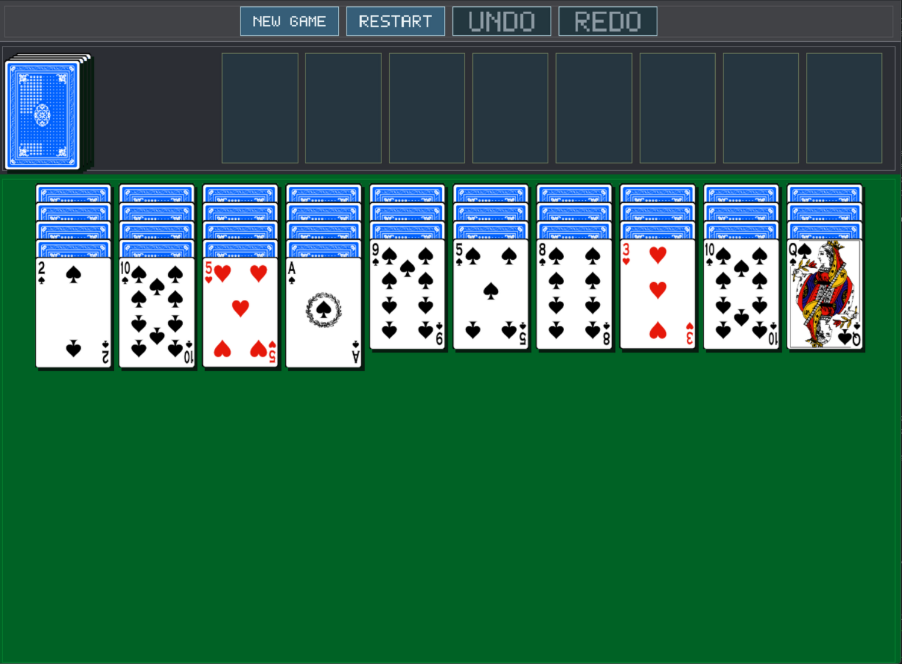

# Spider Two Suites

`Spider Two Suites` is a table-first Spider Solitaire game written in modern C++ with a testable core and an SDL3 desktop app. The current game uses two suits, keeps the focus on the tableau, and supports click-to-move, drag-and-drop, stock dealing, undo, redo, and smooth playfield scrolling.

## How to play

- Use the top-left stock pile to deal the next row of cards.
- Click a face-up card or sequence to select it, then click a destination stack to move it.
- Drag and drop face-up runs between stacks if you prefer direct manipulation.
- Click a selected card again to trigger an automatic move when one is available.
- Use the in-game `NEW GAME`, `RESTART`, `UNDO`, and `REDO` controls at the top of the window.
- Scroll with the mouse wheel when the tableau grows taller than the window.

## Linux

### Build and run

Install CMake, a C++20 compiler, and the SDL3 development packages for your distribution. The app target requires both `SDL3` and `SDL3_image`.

On Fedora-based systems:

```bash
rpm-ostree install SDL3-devel SDL3_image-devel
cmake -S . -B build/app-default
cmake --build build/app-default
./build/app-default/spider_two_suites
```

For core-only checks without SDL, you can build the headless test configuration:

```bash
cmake -S . -B build/test-core -DSPIDER_BUILD_APP=OFF
cmake --build build/test-core
ctest --test-dir build/test-core --output-on-failure
```

### Install the desktop launcher

The repository includes `packaging/linux/spider-two-suites.desktop`, and CMake already installs it together with the binary and PNG assets:

```bash
cmake --install build/app-default --prefix ~/.local
```

After installation, your desktop environment should list **Spider Two Suites** in the application menu. If it does not appear immediately, log out and back in or run your desktop database refresh tool for the current environment.

## Windows

### Build and run

Install:

- Visual Studio 2022 or another compiler with C++20 support
- CMake
- SDL3
- SDL3_image

One straightforward option is `vcpkg`:

```powershell
vcpkg install sdl3 sdl3-image
cmake -S . -B build\app-default `
  -DCMAKE_TOOLCHAIN_FILE=C:\path\to\vcpkg\scripts\buildsystems\vcpkg.cmake
cmake --build build\app-default --config Release
.\build\app-default\Release\spider_two_suites.exe
```

If you install SDL3 and SDL3_image some other way, point CMake at those package locations instead. When running the executable outside the build tree, make sure the required SDL runtime DLLs are available beside `spider_two_suites.exe` or on your `PATH`.

## Project layout

- `src/core/` contains gameplay, layout, and persistence logic without SDL dependencies.
- `src/app/main.cpp` contains the SDL3 window, rendering, input, and asset loading.
- `src/assets/` contains the card atlas, icons, and the game screenshot used above.
- `tests/` contains the core gameplay tests and the SDL-free app smoke test.
